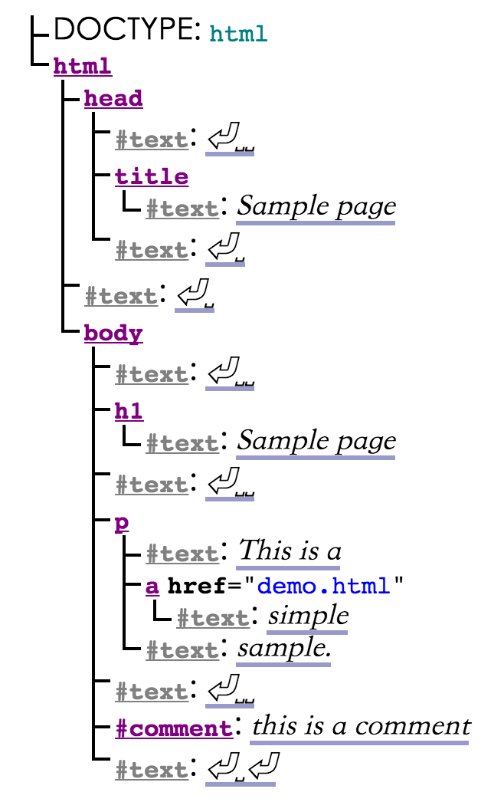

# 0 背景

娱乐向解析枯燥无味的 w3c 文档，章节目录与英文标准文档完全吻合，内容也几乎不会遗漏，结合开发经验做一些笔记。

# 1 介绍

## 1.1 背景 *`非正式`*

HTML 是万维网的标记语言，被设计为用语义描述科学文档。

其通用设计和多年演变使其亦可描述其它类型文档。

尚未解决的领域是 `vague subject referred to as Web Applications`，我对这句话的理解是一些周边领域，比如网络应用，AR VR，或者任何 HTML 可能支持的应用。

## 1.2 致读者 *`非正式`*

w3c 文档要求读者熟悉 web 技术。

## 1.3 范围 *`非正式`*

这个文档描述范围不包含：整个操作系统、为硬件配置的软件、图像处理工具。
包含范围：用户使用频率不特别高，或使用频率高但用户来自不同地域，低CPU要求的应用程序。比如：在线购买系统，搜索系统，游戏（特别是多玩家在线游戏），公共电话簿或地址簿，通信软件（电子邮件客户端，即时消息客户端，聊天软件），文档编辑软件等。

## 1.4 历史 *`非正式`*

- 1990-1995 先后在 CERN 与 IETF 托管。 
- 1995-1997 W3C 创建，第一次拓展 HTML，成为 HTML 3.0，后来用法更加实用，发布了 HTML 3.2。
- 1997-2000 之后 W3C 停止了 HTML 发展，转而投向基于 XML 的 XHTML 工作。这项工作开始于重组 XML 中的 HTML4，被称为 XHTML 1.0，除了新的序列化，没有增加任何新功能，在 2000 年完成。在 XHTML 1.0 之后，W3C 继续发力 XHTML，同时还开发了不与 HTML XHTML 兼容的 XHTML2.
- 1998-2003 大约在 1998 年停止了 HTML 的发展，浏览器供应商开发的 HTML API 为 DOM Level 1（1998年）、DOM Level 2 Core、DOM Level 2 HTML（2000-2003）。2004 年发布了 DOM Level 3 规范，但工作组在草案完成前就关闭了。
- 2003 XForms 问世，被定义为下一代 web 表单技术，激发了对 HTML 的改进，因为 XML 仅限于部署在全新的例如（RSS 和更高版本的 Atom），而不能替代 HTML。而且有概念证明，可以拓展 HTML4 的表单，提供 XForms 的功能，并且完全向前兼容，而且草案已经公开可用，但这个规范的版权仅在 Opera 软件中。
- 2004 应当继续发展 HTML 的想法在 2004 年 W3C 联合 Mozilla 与 Opera 的研讨会提出，阐述了 HTML5 工作原理，但提案被驳回，因为于之前 web 发展方向冲突，W3C 继续开发 XML。
- 2004 但此后不久，Apple, Mozilla, Opera 表示对之前大会不爽，共同宣布将在 [WHATWG](https://html.spec.whatwg.org/) 下继续工作，创建了公共邮件列表，草案移到了 WHATWG 网站，版权修改为三个供应商共有。WHATWG 的核心原则是技术向后兼容，规范于实现要匹配，要求 HTML5 规范要包括 HTML4 XHTML1 于 DOM2 HTML 的内容。
- 2006-2007 W3C 表示有兴趣参与 HTML5 的开发，在 2007 年成立工作组，于 WHATWG 合作开发 HTML5.
- 2008 HTML5 第一个版本发布，各浏览器厂商开始支持 HTML5.
- 2011 W3C 于 WHATWG 发现他们有着不同的目标：W3C 想定死 HTML5 标准，一旦发布就再也无法修改，而 WHATWG 希望继续在 HTML 标准不变的情况下，持续添加新功能。两个标准化组织开始产生裂痕。
- 2012 年中，W3C 推出新的编辑小组负责 HTML5，并为下个 HTML 版本准备草案。

> w3c 官方文档果然掩盖了黑历史，在 W3C 与 WHATWG 分裂期间，W3C 拉拢了微软作为靠山，当时 IE 市场份额占有率超过 70%，一下就超过了 WHATWG 背后的Apple， Mozilla 和 Opera。而 WHATWG 也不是吃素的，找来了 Google 做靠山，而如今 IE 份额不断下滑，Chrome 占有率不断上升，WHATWG 的砝码也越来越大，但内部也产生了分裂。不过目前大部分规范总算得到了统一。

## 1.5 设计 *`非正式`*

HTML 历史悠久，难免会有瑕疵，而且网页中的错误很常见，需要为常见错误设立标准解决方案。

### 1.5.1 脚本的串行 *`非正式`*

HTML DOM API 是完全串行的，即便在 [web-workers](https://www.w3.org/TR/html5/infrastructure.html#worker) 中也是如此。

### 1.5.2 与其它规范的标准 *`非正式`*

本规范与其它规范相互依赖，但也可能有冲突的时候，这时其实违规部分都是有特定原因的，并且会标注出来。

### 1.5.3 拓展性 *`非正式`*

HTML具有大量的可扩展机制，用于安全添加语义：

- 使用 `class` 拓展元素。
- `data - * =“”` 属性用于安全添加数据被脚本使用，浏览器不会干涉这个属性。
- `<meta name =“”content =“”>` 拓展页面元数据。
- `rel =“”` 可以拓展资源类型。
- `<script type =“”>` 嵌入远程服务器的脚本。
- `embed` 标签创建插件，flash也是这样运作的。
- 通过 `JavaScript` 脚本拓展功能。

## 1.6 HTML vs XHTML *`非正式`*

HTML 的文档传输类型为 `text / html`，而 **XHTML 是 XML 的一种应用**，其文档传输类型为 `application / xhtml + xml`。

HTML 于 XML 不同在于，XML 语法检查更加严格，而且 HTML 于 XML 也各有其特定语法，比如命名空间只能在 DOM，XHTML 中使用，而 `noscript` 标签仅能在 HTML 语法中使用。

## 1.7 章节概述 *`非正式`*

1. [简介](https://www.w3.org/TR/html5/introduction.html#introduction) 这些非正式章节为 HTML 标准介绍了背景。
2. [基本概念](https://www.w3.org/TR/html5/infrastructure.html#infrastructure) 介绍了语法、定义等基本概念。
3. [语义，结构和接口](https://www.w3.org/TR/html5/dom.html#dom) 文档由元素构建而成，这些元素形成一棵树，本节介绍了所有元素的特性。
4. [HTML元素](https://www.w3.org/TR/html5/semantics.html#semantics) HTML 元素使用规范，以及实现规范，还包括视频播放、表单和 canvas 等内容。
5. [加载页面](https://www.w3.org/TR/html5/browsers.html#browsers) HTML 文档环境受多方面影响，本节介绍了这些元素，比如网页浏览器以及离线缓存的网页应用。
6. [网页应用程序API](https://www.w3.org/TR/html5/webappapis.html#webappapis) 介绍 HTML 脚本基本功能。
7. [用户交互](https://www.w3.org/TR/html5/editing.html#editing) 本节介绍了交互内容，比如焦点是如何工作的。
8. [HTML语法](https://www.w3.org/TR/html5/syntax.html#syntax) 介绍了语法以及如何解析他们。
9. [XHTML语法](https://www.w3.org/TR/html5/the-xhtml-syntax.html#xhtml) 同第 8 节。
10. [渲染](https://www.w3.org/TR/html5/rendering.html#rendering) 介绍了网页渲染规则。
11. [废弃功能介绍](https://www.w3.org/TR/html5/obsolete.html#obsolete)
12. [IANA](https://www.w3.org/TR/html5/iana.html#iana) IANA 是互联网数字分配机构，本节介绍了传输类型的相关规范。

### 1.7.1 规范阅读技巧

> 文中提到了生产者(producers)与消费者(consumers)，生产者是生产内容的人，即前端开发者，而消费者是消费这些内容的平台，比如浏览器。

作者希望我们和一般读书一样，将规范至少读一遍，然后根据需要随机选择章节查阅。

1. w3c文档不仅描述了前端开发者需要遵循的规范，还包含了对浏览器厂商的规范要求：

> 举例：
>
> "foo属性的值，必须是合法整数"，这是对前端开发者的要求，而"foo属性的值，必须用整型解析规则解析"是对浏览器厂商的要求。

2. 对前端开发者的要求，不会影响到浏览器。

> 举例：
>
> 接着上面的例子，对前端开发者的要求是"foo属性必须合法"，但这里并没有对浏览器处理方式有暗示，浏览器需要将这个属性视为一个黑盒，在解析时处理做好容错。

### 1.7.2 印刷规范

## 1.8 用户隐私 *`非正式`*

由于 IP 无法准确标识用户，所以专门设计了 Cookie 解决这个问题，但这分好的一面和坏的一面。

好的一面，在于收集不同用户特征信息，对其浏览内容做出个性化展示。坏的一面，可能会被不法站点利用，可能会收集用户的家庭地址、身份信息等。由于恶意目的可能是没有底线的，建议浏览器考虑如何提供最小的用户信息。以下几个特征也与用户隐私相关：

- 浏览器所支持功能的列表。
- 脚本最大堆栈递归次数。
- 描述用户信息的功能，比如媒体查询和 [screen 对象](https://www.w3.org/TR/html5/infrastructure.html#screen)。
- 用户本地时间信息。

## 1.9 HTML 简介 *`非正式`*

终于等到第一个 HTML 片段登场了，我们看看官方怎么描述的：

```html
<!DOCTYPE html>
<html>
 <head>
  <title>Sample page</title>
 </head>
 <body>
  <h1>Sample page</h1>
  <p>This is a <a href="demo.html">simple</a> sample.</p>
  <!-- this is a comment -->
 </body>
</html>
```

HTML 由一个包含文本和元素的树状结构组成，每个元素也都有开始标签，比如 `body`，和结束标签，比如 `</body>`（某些情况下的[开始和结束标签会因为其它标签的影响而被忽略](https://www.w3.org/TR/html5/syntax.html#syntax-tag-omission)）。

标签可以嵌套，但不能随意嵌套，比如下面嵌套用法就是错误的：

```html
<p>This is <em>very <strong>wrong</em>!</strong></p>
```

这样才正确：

```html
<p>This <em>is <strong>correct</strong>.</em></p>
```

HTML 元素拥有 `attribute`，这种属性以 `=` 号分割，如果值不包含 `"` `'` \` `=` `<` `>`，那就可以不用双引号包含（单双引号都可以）：

```html
<!-- empty attributes -->
<input name=address disabled>
<input name=address disabled="">

<!-- attributes with a value -->
<input name=address maxlength=200>
<input name=address maxlength='200'>
<input name=address maxlength="200">
```

浏览器将上面的 HTML 标签解析为 DOM（Document Object Model）树，在内存中的对象结构。

Dom 树包含节点类型有：[DocumentType](https://www.w3.org/TR/html5/infrastructure.html#documenttype), [Element](https://www.w3.org/TR/html5/infrastructure.html#element), [Text](https://www.w3.org/TR/html5/infrastructure.html#text-0), [Comment](https://www.w3.org/TR/html5/infrastructure.html#comment-0) 和 [ProcessingInstruction](https://www.w3.org/TR/html5/infrastructure.html#processinginstruction)。

上面的 dom 对象如下图所示：



我们发现，几乎每个元素后面都跟着一个 `text` 元素，`␣` 表示空格，`⏎` 表示换行。然而不是所有换行和回车都会展现在 DOM 对象中，**`head` 标签之前的空格会全部被删除，所有 `body` 之后的空格都会被移动到 `body` 标签末尾。**许多 DOM 元素都可以被 `script` 脚本修改，比如：

```html
<form name="main">
 Result: <output name="result"></output>
 <script>
  document.forms.main.elements.result.value = 'Hello World';
 </script>
</form>
``` 

### 1.9.1 安全使用 HTML *`非正式`*

本节介绍了 HTML 风险的起源，主要包含 XSS 与 CSRF 两方面：

#### XSS（Cross-site scripting）

跨站脚本，对于用户输入、URL参数、第三方站点消息等，必须在使用前验证数据的安全性，并在展示时做正确转义。过滤一定要根据白名单，如果根据黑名单过滤，就会包含许多不确定性的风险。

> 举例：
>
> 比如允许用户输入自定义 url 地址，可能会得到这样的输入：
> ```html 
> http://example.com/message.cgi?say=%3Cscript%3Ealert%28%27Oh%20no%21%27%29%3C/script%3E 
> ```
> 当用户访问时，将会执行自定义脚本。

防范建议：

1. 即便像 `img` 这种无害的标签，也要将允许配置的属性列出白名单，因为如果允许所有属性的话， `onload` 将可能用来执行跨站脚本。
2. URLs 链接，比如超链接，也需要使用白名单过滤，可能的攻击方式是 `javascript:`，不过浏览器一般会对其进行安全验证。
3. 页面插入的任何元素都有安全风险，比如自定提交的表单等。

## links
  * [目录](<preface.md>)
  * 下一节: [123](<01.1.md>)