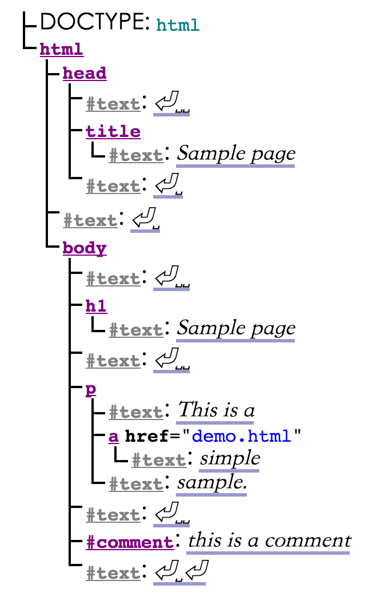

## 1.9 HTML 简介 *`非正式`*

终于等到第一个 HTML 片段登场了，我们看看官方怎么描述的：

```html
<!DOCTYPE html>
<html>
 <head>
  <title>Sample page</title>
 </head>
 <body>
  <h1>Sample page</h1>
  <p>This is a <a href="demo.html">simple</a> sample.</p>
  <!-- this is a comment -->
 </body>
</html>
```

HTML 由一个包含文本和元素的树状结构组成，每个元素也都有开始标签，比如 `body`，和结束标签，比如 `</body>`（某些情况下的[开始和结束标签会因为其它标签的影响而被忽略](https://www.w3.org/TR/html5/syntax.html#syntax-tag-omission)）。

标签可以嵌套，但不能随意嵌套，比如下面嵌套用法就是错误的：

```html
<p>This is <em>very <strong>wrong</em>!</strong></p>
```

这样才正确：

```html
<p>This <em>is <strong>correct</strong>.</em></p>
```

HTML 元素拥有 `attribute`，这种属性以 `=` 号分割，如果值不包含 `"` `'` \` `=` `<` `>`，那就可以不用双引号包含（单双引号都可以）：

```html
<!-- empty attributes -->
<input name=address disabled>
<input name=address disabled="">

<!-- attributes with a value -->
<input name=address maxlength=200>
<input name=address maxlength='200'>
<input name=address maxlength="200">
```

浏览器将上面的 HTML 标签解析为 DOM（Document Object Model）树，在内存中的对象结构。

Dom 树包含节点类型有：[DocumentType](https://www.w3.org/TR/html5/infrastructure.html#documenttype), [Element](https://www.w3.org/TR/html5/infrastructure.html#element), [Text](https://www.w3.org/TR/html5/infrastructure.html#text-0), [Comment](https://www.w3.org/TR/html5/infrastructure.html#comment-0) 和 [ProcessingInstruction](https://www.w3.org/TR/html5/infrastructure.html#processinginstruction)。

上面的 dom 对象如下图所示：



我们发现，几乎每个元素后面都跟着一个 `text` 元素，`␣` 表示空格，`⏎` 表示换行。然而不是所有换行和回车都会展现在 DOM 对象中，**`head` 标签之前的空格会全部被删除，所有 `body` 之后的空格都会被移动到 `body` 标签末尾。**许多 DOM 元素都可以被 `script` 脚本修改，比如：

```html
<form name="main">
 Result: <output name="result"></output>
 <script>
  document.forms.main.elements.result.value = 'Hello World';
 </script>
</form>
``` 

### 1.9.1 安全使用 HTML *`非正式`*

本节介绍了 HTML 风险的起源，主要包含 XSS 与 CSRF 两方面：

#### XSS（Cross-site scripting）

跨站脚本，对于用户输入、URL参数、第三方站点消息等，必须在使用前验证数据的安全性，并在展示时做正确转义。过滤一定要根据白名单，如果根据黑名单过滤，就会包含许多不确定性的风险。

> 举例：
>
> 比如允许用户输入自定义 url 地址，可能会得到这样的输入：
> ```html 
> http://example.com/message.cgi?say=%3Cscript%3Ealert%28%27Oh%20no%21%27%29%3C/script%3E 
> ```
> 当用户访问时，将会执行自定义脚本。

防范建议：

1. 即便像 `img` 这种无害的标签，也要将允许配置的属性列出白名单，因为如果允许所有属性的话， `onload` 将可能用来执行跨站脚本。
2. URLs 链接，比如超链接，也需要使用白名单过滤，可能的攻击方式是 `javascript:`，不过浏览器一般会对其进行安全验证。
3. 页面插入的任何元素都有安全风险，比如自定提交的表单等。

#### CSRF（Cross-site request forgery）

如果允许用户提交表单，要验证用户的来源，因为表单是可以提交到任何域下的。网站可以通过提交隐藏的 token，或者检查请求的 Origin 标头预防此类攻击。

#### 点击劫持

诱导用户点击，比如给用户玩一个小游戏，当用户点击时，快速将一个小 iframe 移动到用户鼠标下，触发了对应站点的点击事件。防止攻击的方式是，不允许嵌入 iframe 的事件（比如判断 window.top 属性）。

### 1.9.2 使用 script 时注意避免的常见错误 *`非正式`*

script 脚本在浏览器会单线程持续执行，直到执行结束才会执行事务。而 HTML 的解析却是异步的，解析中随时可以暂停去处理其它事情。

> 笔者：这就是为何建议我们把脚本放在文档末尾，因为脚本的执行会阻塞后续操作。不过 `defer` 属性可以帮我们达到放在末尾的效果，而 `async` 属性可以让脚本异步执行（async 是 HTML5 属性）。

但是脚本放在最后，可能会错过一些事件触发，比如：

```html

  <!-- load 事件可能在 html 解析空隙中触发，这时脚本还未执行，你就捕获不到 onLoad 事件了！ -->
<script>
  var img = document.getElementById('games');
  img.onload = gamesLogoHasLoaded; // 可能永远不会触发！
</script>
```

避免的方式，是用脚本控制生命周期，确保 HTML 渲染前就绑定了回调：

```html
<script>
 var img = new Image();
 img.src = 'games.png';
 img.alt = 'Games';
 img.onload = gamesLogoHasLoaded;
 // img.addEventListener('load', gamesLogoHasLoaded, false); // 与上面一行效果相同
</script>
```

### 1.9.3 在书写时避免错误

w3c 提供了[在线校验方案](http://validator.w3.org/nu/)

> 笔者：更推荐在 IDE 层面解决错误。

## links
  * [目录](<preface.md>)
  * 下一节: [1.10 用户一致性要求](<01.2.md>)