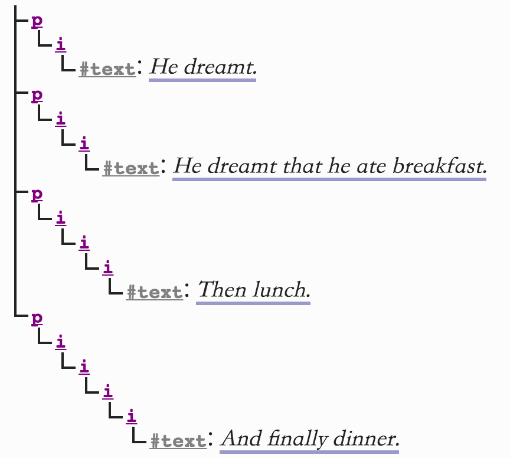

## 1.10 用户一致性要求 *`非正式`*

与之前 HTML 规范不同，此规范对合法、非法文档的细节做了定义。虽然大多数情况，非法文档依然能处理的很棒，但文档规范性依然很重要。

### 1.10.1 表现式标记 *`非正式`*

```html
<font color="">
```

这是一个表现式标记。由于它表意性差，维护成本高，而且增加了文档大小，在 HTML4 时就不再建议使用， XHTML 1.1 已经完全废弃了这个特性，唯一保留的方式是 `style` 属性。

### 1.10.2 语法错误 *`非正式`*

- 无效结构

> 例子
>
> ```html
> <table><hr>...
> ```

- 选择性错误修正

为了避免修复一个错误带来更多复杂的错误，每当遇到解析失败时，允许用户代理（一般指浏览器）抛出异常。

- 错误处理不兼容浏览器

比如上面提到的 `<table><hr>...` 错误，如果与浏览器不兼容，可以认为此语法是无效的。

- 强制转换的错误

当基于 XML 的被 HTML 解析器解析时，可能要将 HTML DOM 强制转换为 XML 兼容的数据，需要这样处理的结构大多时候被认为是无效的。

- 导致性能问题的错误

可能导致性能降低的错误，通常也不允许。

> 例子
>
> ```html
> <p><i>He dreamt.
> <p><i>He dreamt that he ate breakfast.
> <p><i>Then lunch.
> <p><i>And finally dinner.
> ```
> 会导致如下结构：
> 

- 脆弱的语法结构

有些语法结构，由于历史原因相对脆弱，为了减少遇到这种问题，也被认为是不合法的。

> 例子
>
> ```html
> <a href="?art&copy">Art and Copy</a>
> ```
> 这种时候会弄不清楚 `?art&copy` 还是 `?art©`，为了避免这个问题，所有命名字符比如 `&`，必须转义 -> `&amp;`，即：
> ```html
> <a href="?art&amp;copy">Art and Copy</a>
> ```

- 避免在旧浏览器下造成的错误

比如 \` 字符，在旧浏览器会作为引号，所以不建议在双引号内直接使用 \`。另一种是 DOCTYPE，可以触发[非怪异模式](https://www.w3.org/TR/html5/infrastructure.html#no-quirks-mode)，因为怪异模式稳定性无法保证。

- 避免安全问题

避免使用 UTF-7

> 笔者：UTF-7 将 Unicode 字符转换为 ASCII 码呈现，多用于电子邮件传输。其安全问题在于，可能通过各种方式是的utf-7解码生效（正文前设置 bom 标记，`<meta>` 之前设置字符集，或没设置默认字符集的网页），通过对 `<` `>` 的 ASCII 编码，使得绝大多数网站的安全过滤失效，从而形成 XSS 攻击。

- 表意不明确的错误

避免使用如下不明确的标签：

> 例子
>
> ```html
> <h1>Contact details</h2>
> ```

- 拼写错误

当标签拼写错误时，浏览器抛出一个错误，让用户知晓。

- 可能与未来语法产生冲突的错误

为了使语法具有拓展性，不允许使用未定义的用法，比如：在结束标签添加属性，现在文档没有这种规定，但未来可能会有，所以为了避免冲突，现在不要使用这种语法!

### 1.10.3 属性限制

规范还提出了对属性的限制。